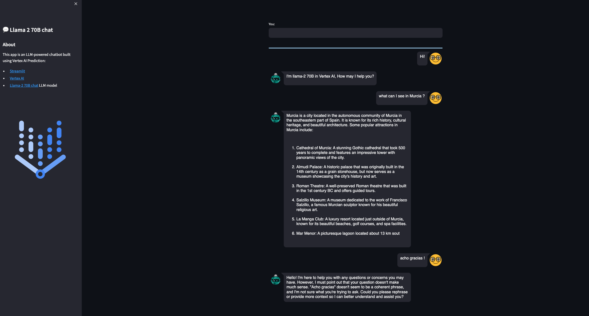

#  Deploy Llama 2 70B on Vertex AI Prediction with GPTQ

This code shows how to **deploy a Llama 2 chat model** (70B parameters) in Vertex AI Prediction with a 2xL4 GPU. The model will be downloaded and embedded in a custom prediction image, using an [Uvicorn](https://www.uvicorn.org/) server. You will use a `g2-standard-24` machine type with 2xL4 NVidia GPU in **Vertex AI Prediction**.

The model is quantized at 4-bits using [GPTQ](https://arxiv.org/abs/2210.17323).

A demo based on [Streamlit](https://streamlit.io/) and deployed in [Cloud Run](https://cloud.google.com/run) is also provided to easily make requests into the deployed model.


## The model: Llama 2

[Llama 2](https://ai.meta.com/llama/) is the next-generation of Meta Large Language Model, released with a [free license for commercial and educational use](https://github.com/facebookresearch/llama/blob/main/LICENSE). Note Clause 2 related the limitation of 700 million monthly active users, that requires a Meta specific license.

Main features of this model are:

* Trained on a new mix of publicly available data, in total around 2T tokens.
* Doubled the context length of the model (4K) compared to Llama 1 (2K).
* Grouped-query attention.
* Available sizes: 7B, 13B, 34B (pretrained only, not chat), 70B parameters.

Model card [here](https://github.com/facebookresearch/llama/blob/main/MODEL_CARD.md) and paper [here](https://arxiv.org/abs/2307.09288).

Here the model to be downloaded from [Hugging Face](https://huggingface.co/TheBloke/Llama-2-70B-chat-GPTQ/tree/main). 


## Build Custom Prediction Container image 

A Custom Container image for predictions is required. A Custom Container image in Vertex AI [requires that the container must run an HTTP server](https://cloud.google.com/ai-platform-unified/docs/predictions/custom-container-requirements#image). Specifically, the container must listen and respond to liveness checks, health checks, and prediction requests. 

You will use a [Uvicorn](https://www.uvicorn.org/) server. You must build and push the container image to [Artifact Registry](https://cloud.google.com/artifact-registry):
```sh
gcloud auth configure-docker europe-west4-docker.pkg.dev
gcloud builds submit --tag europe-west4-docker.pkg.dev/argolis-rafaelsanchez-ml-dev/ml-pipelines-repo/llama2-70b-chat --machine-type=e2-highcpu-8 --timeout="2h" --disk-size=300 && python3.10 upload_custom.py 
```

This build process should take **2-3 hours**  with a `e2-highcpu-8`.


## Deploy the model to Vertex AI Prediction

Upload and deploy the image to Vertex AI Prediction using the provided script: `python3 upload_custom.py`. 

The upload and deploy process **may take up to 30 min**. Note the parameter `deploy_request_timeout` to avoid a `504 Deadline Exceeded` error during the deployment:
```python
model = Model.upload(
    display_name="llama2-70B-chat", 
    description=f'llama2-70B-chat with Uvicorn and FastAPI',
    serving_container_image_uri=DEPLOY_IMAGE,
    serving_container_predict_route=PREDICT_ROUTE,
    serving_container_health_route=HEALTH_ROUTE,
    serving_container_ports=SERVING_CONTAINER_PORTS,
    location="europe-west4",
    upload_request_timeout=1200,
    sync=True,
    )

# Retrieve a Model on Vertex
model = Model(model.resource_name)

# Deploy model
endpoint = model.deploy(
    machine_type="g2-standard-24",
    accelerator_type="NVIDIA_L4",
    accelerator_count=2,
    traffic_split={"0": 100}, 
    min_replica_count=1,
    max_replica_count=1,
    traffic_percentage=100,
    deploy_request_timeout=1200,
    sync=True,
)
endpoint.wait()
```

The [cost of a Vertex Prediction endpoint](https://cloud.google.com/vertex-ai/pricing#prediction-prices) (24x7) for a `g2-standard-24` machine is calculated in node hours, considering **vCPU cost** (measured in vCPU hours) and **RAM cost** (measured in GB hours). In this case, a `g2-standard-24` has a node hour for `europe-west4` of `USD 2.5338 per hour ` and the estimated total cost including 2xL4 GPUs is `(2.5338*24 + 2.5338*96)*24*30 = 304 USD per month`.


## Streamlit demo UI

You are now ready to predict on the deployed model. You can use the REST API or the python SDK, but in this case you will build a simple demo UI using [Streamlit](https://streamlit.io/). There are many other similar UI libraries, like Gradio, but this time let's use Streamlit.

The Streamlit app is built on [Cloud Run](https://cloud.google.com/run). You need to [build the docker first](https://docs.streamlit.io/knowledge-base/tutorials/deploy/docker), upload it to Artifact registry and then deploy it in Cloud Run:
```sh
gcloud builds submit --tag europe-west4-docker.pkg.dev/argolis-rafaelsanchez-ml-dev/ml-pipelines-repo/llama2-70b-chat-streamlit 
gcloud run deploy llama2-70b-chat-streamlit --port 8501 --image europe-west4-docker.pkg.dev/argolis-rafaelsanchez-ml-dev/ml-pipelines-repo/llama2-70b-chat-streamlit --allow-unauthenticated --region=europe-west4 --platform=managed  
```

> NOTE: in the last two sections you have created two dockers, one **to host the Llama 2 model** (a custom container image which is then deployed in Vertex AI) and the other one (the one in this section) **to host the Streamlit app** that will call the model.

The Streamlit app is now deployed in Cloud Run. You can test the provided examples ot try yours. Please, note the purpose of this post is not to evaluate the performance of the Llama 2-7B chat model, but to show how to deploy a model like this in Vertex AI and Cloud Run. You may get better results with higher quantized versions or bigger models like Llama 2-13B.




## References

`[1]` Research paper: [Llama 2](https://arxiv.org/abs/2307.09288)      
`[2]` Original [Llama 2 Checkpoints](https://github.com/facebookresearch/llama#download)        
`[3]` Medium post: [How to build an LLM-powered chatbot with Streamlit](https://medium.com/streamlit/how-to-build-an-llm-powered-chatbot-with-streamlit-a1bf0b2701e8)      
`[4]` Medium post: [4-bit Quantization with GPTQ](https://towardsdatascience.com/4-bit-quantization-with-gptq-36b0f4f02c34)    